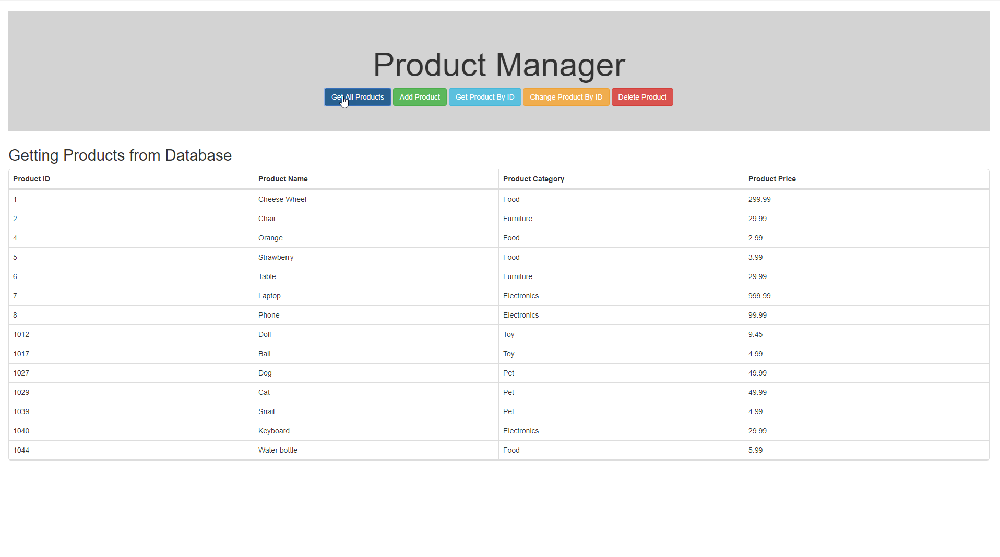

# ProductManager
Created an API which interacts with the website created in ReactJS and the database.

- Database: SQL Server in docker
- API: ASP.net Core in docker
- Frontend: ReactJS + TypeScript

Tools used
- Swagger
- StyleCop
- Docker

