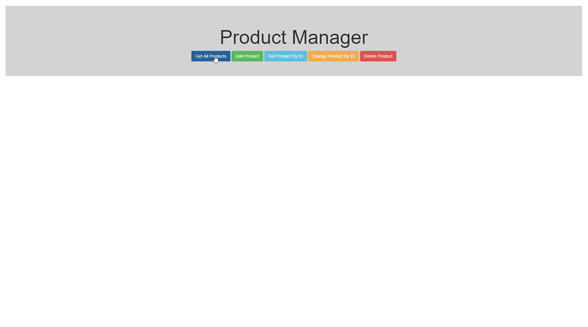
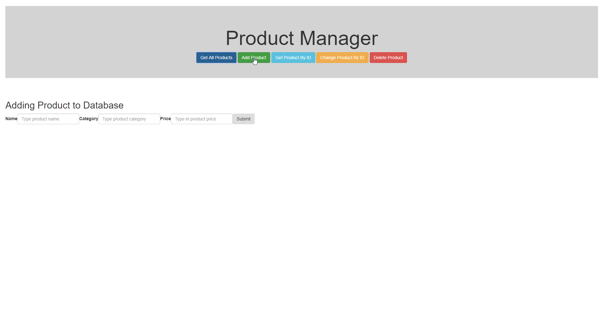
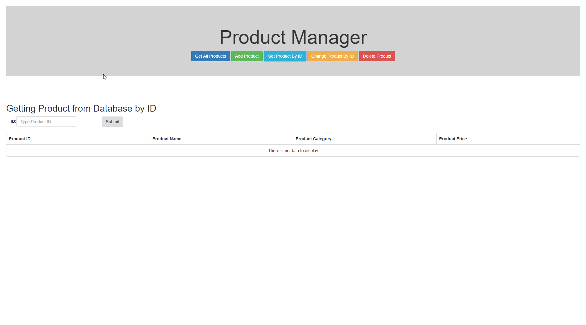
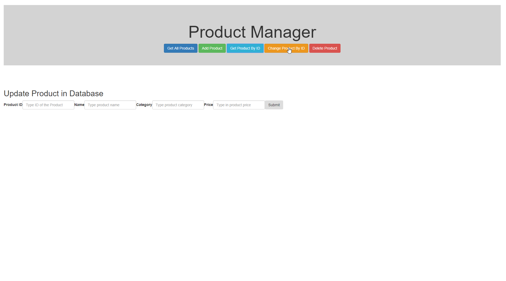
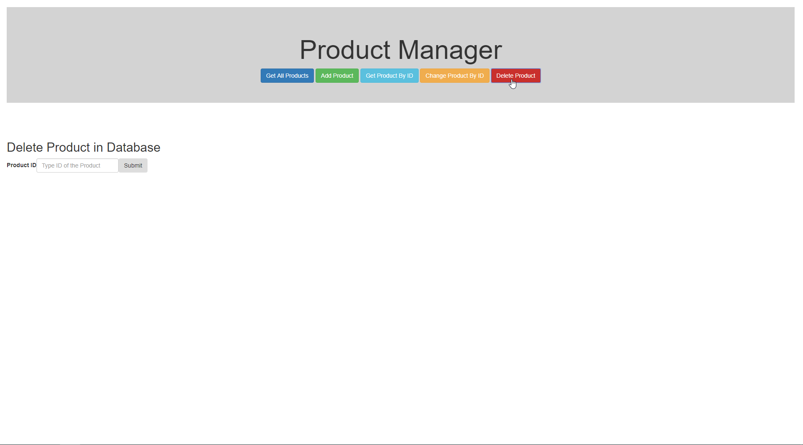

# ProductManager
Created an API which interacts with the website created in ReactJS and the database.

- Database: SQL Server in docker - (Linux)
- API: in docker - (Runs through Visual Studio 2017)
- Frontend: Runs through localhost

Tools used
- Swagger
- StyleCop
- Docker

